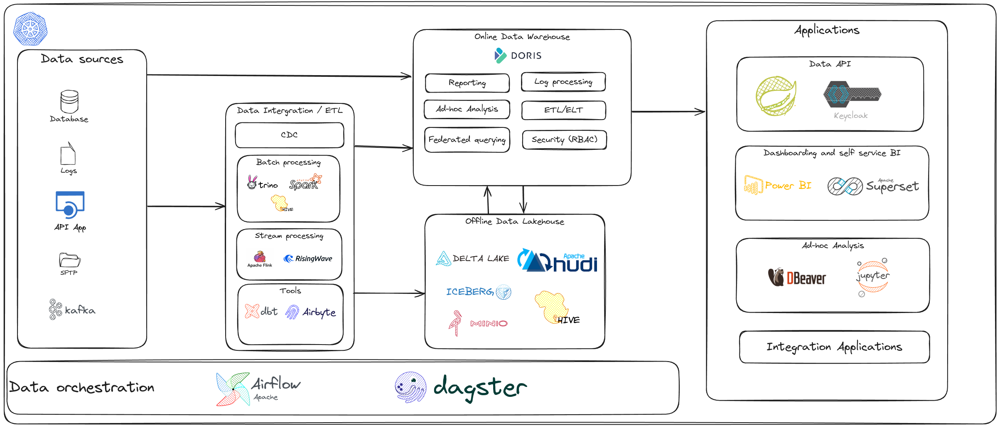

## Data Architecture




## Create Kubernetes Local Cluster (Using Kind)
```
kind create cluster --name dev --config kind-config.yaml
```
## Install ArgoCD
 
```
k create namespace argocd
k apply -n argocd -f https://raw.githubusercontent.com/argoproj/argo-cd/v2.10.5/manifests/install.yaml
k -n argocd edit svc/argocd-server
k -n argocd get svc
k -n argocd get secrets argocd-initial-admin-secret --template={{.data.password}} | base64 -d
```

## Install Ingress Nginx
 
```
k apply -f charts/nginx-ingess-deploy.yaml
```

## Install Metric Server
 
```
k apply -f charts/metric-server.yaml
```

## Install Minio
```
helm upgrade --install minio -n minio -f ./charts/minio/minio-values.yaml ./charts/minio --create-namespace --debug
```

## Install Hive Metastore
```
helm upgrade --install metastore-db -n metastore -f ./charts/postgres/hive-metastore-postgres-values.yaml ./charts/postgres --create-namespace --debug
helm upgrade --install hive-metastore -n metastore -f ./charts/hive-metastore/hive-metastore-values.yaml ./charts/hive-metastore --create-namespace --debug
```

## Install Airflow
```
helm upgrade --install airflow -n airflow -f ./charts/airflow/airflow-values.yaml ./charts/airflow/ --create-namespace --debug
```

## Data Sample
```
link: https://d37ci6vzurychx.cloudfront.net/trip-data/yellow_tripdata_2009-01.parquet
source: https://github.com/toddwschneider/nyc-taxi-data

```
## Install Spark Operator
```
helm repo add spark-operator https://kubeflow.github.io/spark-operator 
helm upgrade --install spark-operator spark-operator/spark-operator --namespace spark-operator --set webhook.enable=true --create-namespace --debug
kubectl create role spark-operator-submitter --verb=create,get --resource=sparkapplications,pods/log --namespace=spark-operator
kubectl create rolebinding airflow-worker-spark-submitter --role=spark-operator-submitter --serviceaccount=airflow:airflow-worker --namespace=spark-operator
```

## Create S3 Connection in Airflow Ui (Airflow Remote Logging)
```
Connection Id: s3_default
Connection Type: Amazon Web Services
AWS Access Key ID: admin 
AWS Secret Access Key: password
Extra: {"endpoint_url": "http://minio.minio.svc.cluster.local:9000"}
```

## Create Kubernetes Connection in Airflow Ui

```
Connection Id: kubernetes_default
Connection Type: Kubernetes Cluster Connection
In cluster configuration: yes
Disable SSL: yes
```

## Install Trino
```
helm upgrade --install trino -n trino -f ./charts/trino/trino-values.yaml ./charts/trino --create-namespace --debug

kubectl -n trino get po                                                                                                                    
#NAME                                READY   STATUS    RESTARTS   AGE
#trino-coordinator-6bfb99bf9-j7swp   1/1     Running   0          5m17s
#trino-worker-6f8645fc67-76d54       1/1     Running   0          5m17s
#trino-worker-6f8645fc67-d7svb       1/1     Running   0          5m17s

k -n trino exec -it trino-coordinator-6bfb99bf9-j7swp trino
trino> show schemas from lakehouse;
#       Schema       
#--------------------
# default            
# information_schema 
# nyc                
#(3 rows)

trino> show tables from lakehouse.nyc;
#    Table    
#-------------
# taxis_large 
#(1 row)

trino> select * from lakehouse.nyc.taxis_large limit 10;
# vendor_name | trip_pickup_datetime | trip_dropoff_datetime | passenger_count |   trip_distance    |     start_lon      | start_lat | rate>
#-------------+----------------------+-----------------------+-----------------+--------------------+--------------------+-----------+----->
# CMT         | 2009-01-02 22:24:12  | 2009-01-02 22:30:18   |               2 |                1.0 |         -73.970842 | 40.755679 |     >
# VTS         | 2009-01-20 14:54:00  | 2009-01-20 14:57:00   |               1 |               0.56 |         -73.986705 |  40.74549 |     >
# CMT         | 2009-01-05 07:40:42  | 2009-01-05 07:46:42   |               1 |                1.3 |         -73.974125 | 40.783851 |     >
# CMT         | 2009-01-03 00:27:27  | 2009-01-03 00:35:43   |               1 |                1.6 |         -74.009746 | 40.706201 |     >
# CMT         | 2009-01-05 14:03:46  | 2009-01-05 14:21:40   |               1 |                3.5 | -73.98064599999998 | 40.750467 |     >
# CMT         | 2009-01-05 20:23:25  | 2009-01-05 20:33:14   |               2 |                1.2 |         -73.992506 | 40.694179 |     >
# CMT         | 2009-01-01 13:32:49  | 2009-01-01 13:50:48   |               3 |                4.0 |         -73.993933 | 40.735112 |     >
# CMT         | 2009-01-05 17:18:41  | 2009-01-05 17:22:16   |               1 |                1.0 | -73.96976499999998 | 40.753186 |     >
# CMT         | 2009-01-05 17:30:30  | 2009-01-05 17:37:18   |               1 |                1.6 |         -73.960109 | 40.781185 |     >
# CMT         | 2009-01-05 16:53:07  | 2009-01-05 16:55:24   |               1 | 0.5999999999999999 |         -73.996128 | 40.744313 |     >
#(10 rows)

```

## Trino Pivot

```
with dataset(Feature_Area, Feature, Product, Status) as
         (values ('User experience', 'Sign Up', 'App1', 0),
                 ('User experience', 'Sign Up', 'App1', 1),
                 ('User experience', 'Sign Up', 'App1', 7),
                 ('User experience', 'Sign Up', 'App2', 1),
                 ('User experience', 'Log off', 'App1', 2),
                 ('User experience', 'Log off', 'App2', 3),
                 ('Back End', 'Update User', 'App3', 4),
                 ('Back End', 'Delete User', 'App3', 5)),
     agg as (select Feature_Area, Feature, Product, avg(Status) as avg_col
             from dataset
             group by 1, 2, 3),
     map_agg as (select Feature_Area, Feature, map_agg(Product, avg_col) as key_1
                 from agg
                 group by 1, 2)
SELECT Feature_Area,
       Feature,
       element_at(key_1, 'App1') AS App1,
       element_at(key_1, 'App2') AS App2,
       element_at(key_1, 'App3') AS App3
from map_agg
```
## Install Apache Doris

```
helm upgrade --install operator ./charts/doris-operator --namespace doris --create-namespace --debug
k apply -f doris/doriscluster-sample-storageclass.yaml
k run mysql-client --image=mysql:5.7 -it --rm --restart=Never --namespace=doris -- /bin/bash

mysql -uroot -P9030 -hdoriscluster-sample-storageclass1-fe-service
mysql> SET PASSWORD FOR 'root' = PASSWORD('12345678');
mysql> SET PASSWORD FOR 'admin' = PASSWORD('12345678');
mysql> CREATE CATALOG iceberg PROPERTIES (
    "type"="iceberg",
    "iceberg.catalog.type"="hms",
    "hive.metastore.uris" = "thrift://10.96.53.242:9083",
    "warehouse" = "s3://lakehouse",
    "s3.access_key" = "admin",
    "s3.secret_key" = "password",
    "s3.endpoint" = "http://10.96.108.45:9000",
    "s3.region" = "us-east-1"
);
mysql> select vendor_name, trip_pickup_datetime from iceberg.nyc.taxis_large limit 10;
```

## Install Risingwave

```
kubectl create -f https://github.com/jetstack/cert-manager/releases/download/v1.8.2/cert-manager.yaml
kubectl apply --server-side -f ./risingwave/risingwave-operator.yaml
helm upgrade --install operator -f ./risingwave/etcd-values.yaml ./charts/etcd --namespace risingwave --create-namespace --debug
k apply -f ./risingwave/risingwave.yaml

k run mysql-client --image=mysql:5.7 -it --rm --restart=Never --namespace=doris -- /bin/bash
mysql -uroot -P9030 -hdoriscluster-sample-storageclass1-fe-service
mysql> create table demo.demo_bhv_table(
	seq_id bigint, 
    user_id bigint,
    user_name varchar
)
DISTRIBUTED BY HASH(user_id) BUCKETS 32;

kubectl apply -f ../risingwave/psql-console.yaml
kubectl -n risingwave exec -it psql-console -- bash
psql -h risingwave-frontend -p 4567 -d dev -U root

dev=> ALTER USER root WITH PASSWORD '12345678';
dev=> CREATE SOURCE s1_source (
     seq_id bigint, 
     user_id bigint,
     user_name varchar)
WITH (                    
     connector = 'datagen',
     fields.seq_id.kind = 'sequence',
     fields.seq_id.start = '1',
     fields.seq_id.end = '10000000',
     fields.user_id.kind = 'random',
     fields.user_id.min = '1',
     fields.user_id.max = '10000000',
     fields.user_name.kind = 'random',
     fields.user_name.length = '10',
     datagen.rows.per.second = '100'
 ) FORMAT PLAIN ENCODE JSON;
dev=> CREATE SINK doris_sink FROM s1_source
WITH (
    connector = 'doris',
    type = 'append-only',
    doris.url = 'http://doriscluster-sample-storageclass1-fe-service.doris:8030',
    doris.user = 'root',
    doris.password = '12345678',
    doris.database = 'demo',
    doris.table='demo_bhv_table',
    force_append_only='true'
);


k run mysql-client --image=mysql:5.7 -it --rm --restart=Never --namespace=doris -- /bin/bash
mysql -uroot -P9030 -hdoriscluster-sample-storageclass1-fe-service
mysql> select count(1) from demo.demo_bhv_table;
```
